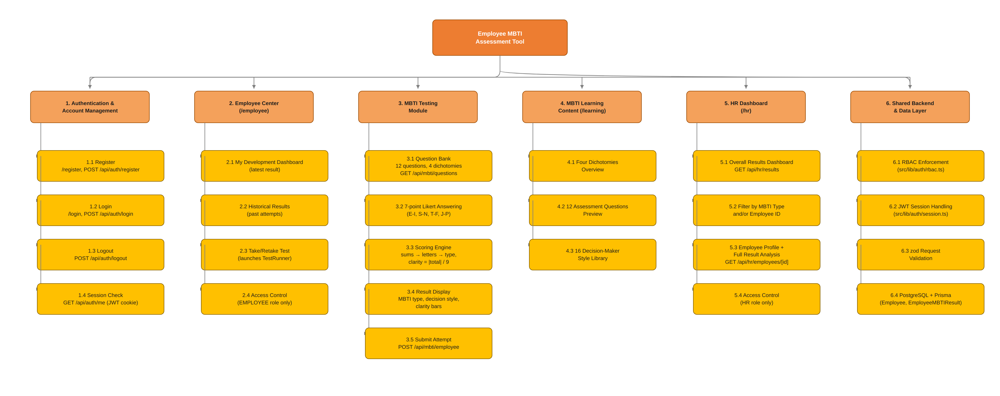
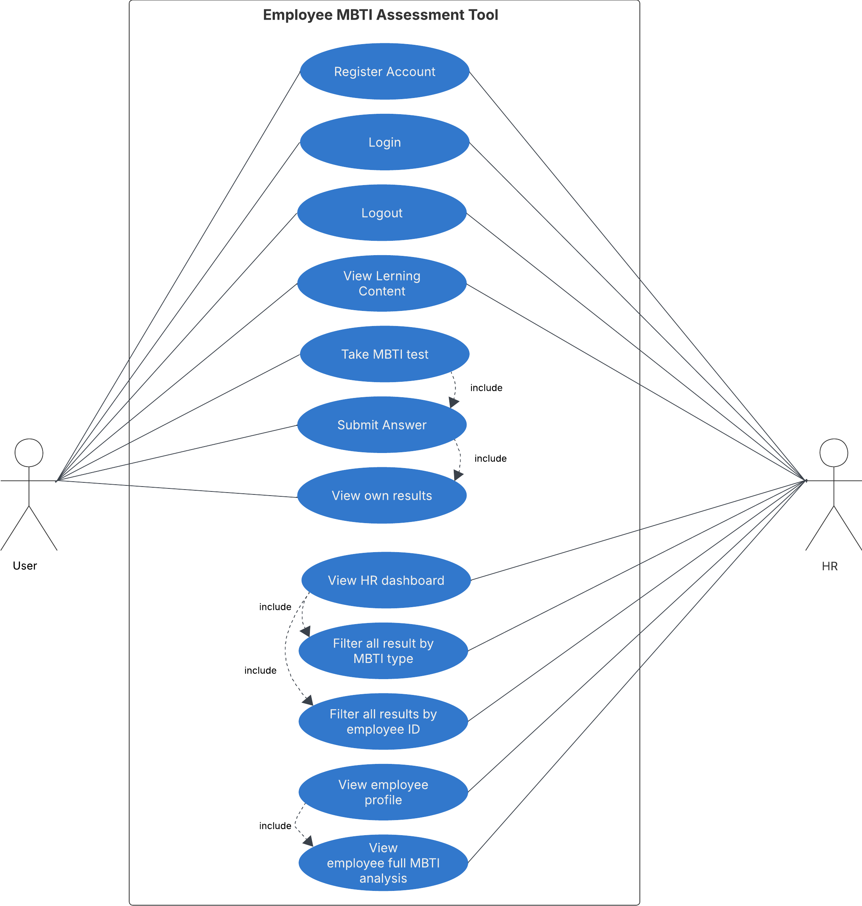
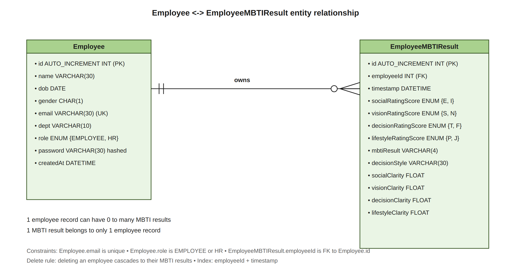
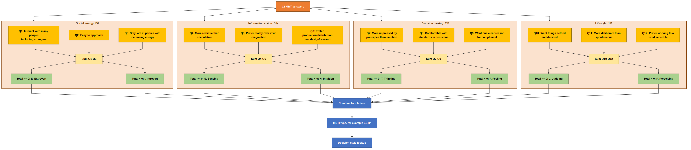
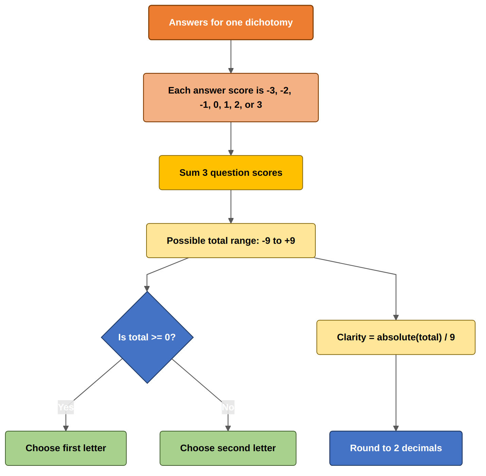

# Employee MBTI Assessment Tool

An **MBTI personality assessment tool** for internal employees. Employees register, log in, take the **MBTI test** (as many times as they like), view **learning content**, and review their **past test results**. HR accesses an **overall dashboard** of all employee MBTI results with **filtering by MBTI type and Employee ID**, and can click any record to view the **full employee profile and full test result analysis**.

---

## ⚙️ How It Works

```
 Employee                              System
 ────────                              ──────
 take test ──────────────────►  12-question MBTI test
                                (7-point Likert,
                                 E-I → S-N → T-F → J-P)
                                        │
                                        ▼
                              ┌─────────────────────────┐
                              │     Scoring Engine      │
                              │  sums → letters → type  │
                              │  clarity = |total| / 9  │
                              │  type → decision style  │
                              └─────────────────────────┘
                                        │
         ┌──────────────────────────────┴─────────────────────┐
         ▼                                                    ▼
  Employee                                             HR
  view own result + clarity bars,                      overall dashboard (filterable by
  review past attempts                                 MBTI type / Employee ID) → full
                                                       employee profile + result analysis
```

**Scoring in short:** each of the 4 dichotomies (E-I Social, S-N Vision, T-F Decision, J-P Lifestyle) has 3 questions scored −3…+3. The letter with the higher (or tied) total wins; `clarity = |total| / 9`; the resulting 16-type combination maps to a named style (e.g. `ENTJ → The Commander`). The engine is a pure function covered by unit tests, including the grading-spec worked example.

### Tech Stack

| Layer | Technology |
|---|---|
| Frontend + Backend | Next.js 15 (App Router, TypeScript) — API route handlers, no separate backend |
| Database | PostgreSQL 16 + Prisma ORM (type-safe schema + migrations) |
| Auth | Custom JWT session in an httpOnly cookie (`jose`), bcrypt password hashing |
| Validation | zod on every API request body |
| RBAC | Server-side role enforcement in every API handler (`src/lib/auth/rbac.ts`) |
| Styling | Tailwind CSS v4 |
| Unit tests | Vitest (scoring engine incl. the grading-spec worked example) |
| Deployment | Docker Compose — `web` + `db` services + one-shot migration container |

## 👥 Actors & What Each Can Do

| Capability | Internal Employee | HR |
|---|:---:|:---:|
| Register / login | ✓ | ✓ |
| View MBTI learning content | ✓ | — |
| Take MBTI test (0..many times) | ✓ | — |
| View own MBTI results / history | ✓ | — |
| Overall results dashboard with filters | — | ✓ |
| View full employee profile + result analysis | — | ✓ |

Every rule above is enforced **server-side** on each API route — hiding a button in the UI is not the security boundary.

---

## 🧩 Use Cases

| # | Use Case | Where |
|---|---|---|
| UC1 | Internal Employee registration & login | `/register`, `/login` |
| UC2 | HR registration & login | `/register`, `/login` |
| UC3 | Employee takes the MBTI test (0..many times) | `/employee` |
| UC4 | Employee views MBTI learning sources | `/learning` |
| UC5 | Employee reviews past test results | `/employee` |
| UC6 | HR dashboard: all results, filter by MBTI type & Employee ID, click a row for full analysis | `/hr`, `/hr/employees/[id]` |

---

## 📐 Architecture & Diagrams

> Drop your exported images into `docs/diagrams/` using the filenames below, and they'll render automatically on GitHub. Swap the paths if you keep them somewhere else.

### System Structure Chart



### Use Case Diagram



### ER Diagram



### MBTI Question Classification Model

```mermaid
%%{init: {"flowchart": {"htmlLabels": true, "curve": "linear"}, "themeVariables": {"fontFamily": "Arial", "fontSize": "14px"}}}%%
flowchart TD
  ROOT["12 MBTI answers"]:::root

  ROOT --> EI
  ROOT --> SN
  ROOT --> TF
  ROOT --> JP

  subgraph EI ["Social energy: E/I"]
    direction TB
    eiQ1["Q1: Interact with many people,<br/>including strangers"]:::q
    eiQ2["Q2: Easy to approach"]:::q
    eiQ3["Q3: Stay late at parties with<br/>increasing energy"]:::q
    eiSum["Sum Q1-Q3"]:::sum
    eiQ1 --> eiSum
    eiQ2 --> eiSum
    eiQ3 --> eiSum
    eiE["Total >= 0: E, Extrovert"]:::result
    eiI["Total < 0: I, Introvert"]:::result
    eiSum --> eiE
    eiSum --> eiI
  end

  subgraph SN ["Information vision: S/N"]
    direction TB
    snQ4["Q4: More realistic than<br/>speculative"]:::q
    snQ5["Q5: Prefer reality over vivid<br/>imagination"]:::q
    snQ6["Q6: Prefer production/distribution<br/>over design/research"]:::q
    snSum["Sum Q4-Q6"]:::sum
    snQ4 --> snSum
    snQ5 --> snSum
    snQ6 --> snSum
    snS["Total >= 0: S, Sensing"]:::result
    snN["Total < 0: N, Intuition"]:::result
    snSum --> snS
    snSum --> snN
  end

  subgraph TF ["Decision making: T/F"]
    direction TB
    tfQ7["Q7: More impressed by<br/>principles than emotion"]:::q
    tfQ8["Q8: Comfortable with<br/>standards in decisions"]:::q
    tfQ9["Q9: Want one clear reason<br/>for compliment"]:::q
    tfSum["Sum Q7-Q9"]:::sum
    tfQ7 --> tfSum
    tfQ8 --> tfSum
    tfQ9 --> tfSum
    tfT["Total >= 0: T, Thinking"]:::result
    tfF["Total < 0: F, Feeling"]:::result
    tfSum --> tfT
    tfSum --> tfF
  end

  subgraph JP ["Lifestyle: J/P"]
    direction TB
    jpQ10["Q10: Want things settled<br/>and decided"]:::q
    jpQ11["Q11: More deliberate than<br/>spontaneous"]:::q
    jpQ12["Q12: Prefer working to a<br/>fixed schedule"]:::q
    jpSum["Sum Q10-Q12"]:::sum
    jpQ10 --> jpSum
    jpQ11 --> jpSum
    jpQ12 --> jpSum
    jpJ["Total >= 0: J, Judging"]:::result
    jpP["Total < 0: P, Perceiving"]:::result
    jpSum --> jpJ
    jpSum --> jpP
  end

  eiE --> COMBINE["Combine four letters"]:::final
  eiI --> COMBINE
  snS --> COMBINE
  snN --> COMBINE
  tfT --> COMBINE
  tfF --> COMBINE
  jpJ --> COMBINE
  jpP --> COMBINE

  COMBINE --> TYPE["MBTI type, for example ESTP"]:::final
  TYPE --> STYLE["Decision style lookup"]:::final

  classDef root fill:#ED7D31,stroke:#833C00,stroke-width:1.5px,color:#ffffff,font-weight:bold;
  classDef q fill:#FFC000,stroke:#7F6000,stroke-width:1px,color:#000000;
  classDef sum fill:#FFE699,stroke:#7F6000,stroke-width:1px,color:#000000;
  classDef result fill:#A9D18E,stroke:#375623,stroke-width:1px,color:#000000;
  classDef final fill:#4472C4,stroke:#1F3864,stroke-width:1.2px,color:#ffffff,font-weight:bold;

  style EI fill:#FBE2CE,stroke:#833C00,stroke-width:1.2px,color:#5A2D00
  style SN fill:#FBE2CE,stroke:#833C00,stroke-width:1.2px,color:#5A2D00
  style TF fill:#FBE2CE,stroke:#833C00,stroke-width:1.2px,color:#5A2D00
  style JP fill:#FBE2CE,stroke:#833C00,stroke-width:1.2px,color:#5A2D00
```



<details>
<summary>Prefer a live, editable diagram instead of a static image? Click to expand the Mermaid source (GitHub renders this natively).</summary>



</details>

### Scoring & Clarity Tree



---

## 🚀 Getting Started

### Option A — Docker (recommended)

```bash
docker compose up --build -d
```

- App: **http://localhost:3000**
- PostgreSQL: container `db`, exposed on host port **5433**, user `mbti` / password `mbti_secret` / database `mbti_db`
- Database migrations run automatically in a one-shot `migrate` container before the web app starts.

Then load the demo data **once** from the host:

```bash
npm install
npm run db:seed
```

### Option B — Local development

```bash
npm install
docker compose up -d db          # database only
npx prisma migrate dev           # create/update schema
npm run db:seed                  # demo data
npm run dev                      # http://localhost:3000
```

### Run the tests

```bash
npm test        # unit tests, incl. the grading-spec worked example (ESTP / The Dealmaker)
```

## 🎭 Demo Accounts

All demo accounts use the password **`Password123!`**. The seed is idempotent — re-running it never duplicates data.

| Role | Demo email | Lands on |
|---|---|---|
| HR | `hr.exec@university.edu` | `/hr` |
| Internal Employee | `staff.sci@university.edu` (also `nadia.rahman@`, `li.wei@university.edu`) | `/employee` |

### 👤 As an Internal Employee

Log in: `staff.sci@university.edu`

1. Land on **My Development Dashboard** — latest result plus all past attempts.
2. Open **MBTI Learning Content** to understand the framework first.
3. Click **Take/Retake MBTI Test** — 4 blocks of 3 questions on a 7-point scale.
4. Submit → see your **MBTI type, style, and clarity bars**; every attempt is kept in **Historical Results**.

### 👤 As HR

Log in: `hr.exec@university.edu`

1. Land on the **HR Dashboard** — every employee MBTI result as a row of records.
2. Filter by **MBTI type** (e.g. `INTJ`) and/or **Employee ID**.
3. Click any row → the **full employee profile** with full analysis of each test attempt (type, style, letters, clarity bars).

## 🔌 API Endpoints

All endpoints are JSON; authentication = the `mbti_session` httpOnly cookie set by login.

| Method & Path | Role(s) | Purpose |
|---|---|---|
| POST `/api/auth/register` | public | Register an Internal Employee or HR user |
| POST `/api/auth/login` | public | Login (sets session cookie) |
| POST `/api/auth/logout` | authenticated | Logout (clears session cookie) |
| GET `/api/auth/me` | authenticated | Current session |
| GET `/api/mbti/questions` | EMPLOYEE | Question bank + Likert options + 16 styles |
| POST `/api/mbti/employee` | EMPLOYEE | Submit a test attempt (12 answers, 7-point Likert) |
| GET `/api/mbti/employee` | EMPLOYEE | Own result history (newest first) |
| GET `/api/hr/results?mbti=&employeeId=` | HR | All results, filterable by MBTI type and/or Employee ID |
| GET `/api/hr/employees/[id]` | HR | Full employee profile + all their test results |

## 🗄️ Database Schema (overview)

| Model | Purpose |
|---|---|
| `Employee` | Internal employee or HR user (`role`: `EMPLOYEE` \| `HR`) |
| `EmployeeMBTIResult` | Test result (retake-able, with full history per employee) |

Full detail: `prisma/schema.prisma`.
